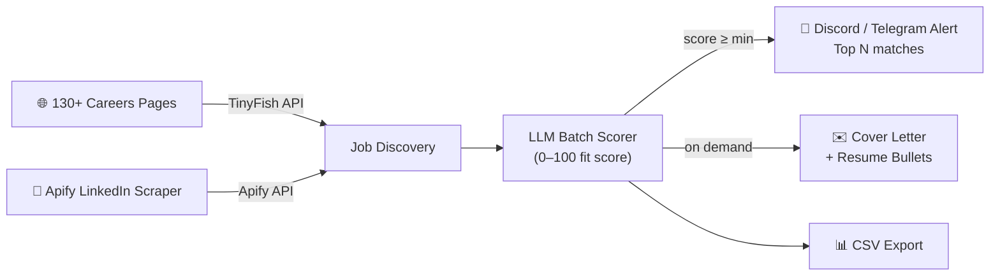

# autopilot-jobhunt

<!-- mcp-name: io.github.tarunlnmiit/autopilot-jobhunt -->

**Your AI job agent. Finds, scores, and drafts applications — while you sleep.**

> Scans 130+ company careers pages plus optional Apify LinkedIn searches → scores every role against your resume with an LLM → sends you the top matches on Discord or Telegram → drafts a tailored resume + cover letter on demand.
>
> 🔒 **Drafts only — never applies.** You review every draft and submit applications yourself. See [PRIVACY.md](PRIVACY.md) for exactly what data leaves your machine.

<p align="center">
  
</p>

[](https://github.com/tarunlnmiit/autopilot-jobhunt/actions/workflows/ci.yml)
[](https://codecov.io/gh/tarunlnmiit/autopilot-jobhunt)
[](https://pypi.org/project/autopilot-jobhunt/)
[](https://pypi.org/project/autopilot-jobhunt/)
[](https://www.python.org/)
[](LICENSE)
[](https://github.com/tarunlnmiit/autopilot-jobhunt/stargazers)
[](https://glama.ai/mcp/servers/tarunlnmiit/autopilot-jobhunt)

Published on [PyPI](https://pypi.org/project/autopilot-jobhunt/) and listed on the [Official MCP Registry](https://registry.modelcontextprotocol.io) (`io.github.tarunlnmiit/autopilot-jobhunt`), [Glama](https://glama.ai/mcp/servers/tarunlnmiit/autopilot-jobhunt) (Quality A), and [Smithery](https://smithery.ai/servers/tarungupta-y12/autopilot-jobhunt) (MCPB bundle).

**[📖 Full setup guide with Claude Code MCP integration → SETUP.md](SETUP.md)**

> ### ⭐ Star this repo if it helps you land a job
> This tool is free, open source, and runs entirely on your machine — no subscription, no credit card. The only "payment" I ask: **if it surfaces a role you apply to (or land), drop a star.** It takes one click, costs you nothing, and it's the single thing that pushes the project in front of the next person grinding through 130 careers pages by hand. **[⭐ Star it here →](https://github.com/tarunlnmiit/autopilot-jobhunt/stargazers)**

---

## How it works



**The scoring prompt uses your actual resume** — not keywords. The LLM reads your full work history and the job description, then explains in one sentence why you fit or don't. No more guessing.

### What a scan result looks like

```
Scanning Mistral AI...
  3 new job URLs. Fetching details...
  Scoring jobs...
  Saved 2 jobs from Mistral AI

Scanning HuggingFace...
  5 new job URLs. Fetching details...
  Scoring jobs...
  Saved 3 jobs from HuggingFace

Scanning Stripe...
  No new jobs found
...
Scan complete.
Top 5 sent to Discord/Telegram.
```

### What the Telegram notification looks like

```
Job Hunt — 06 Jun 2026
5 matches found

#1 | Mistral AI | Applied AI Engineer, ML Infrastructure
📍 Paris/London/Marseille, On-site
🔧 Python, LLMs, RAG, AWS, MLOps, DevOps
✅ Role combines applied AI + ML infrastructure in EU, aligns with MLOps/RAG expertise and relocation goal
Score: 85/100  →  https://jobs.lever.co/mistral/...

#2 | HuggingFace | Staff ML Engineer
📍 Remote (EU)
🔧 Python, PyTorch, Transformers, CUDA, MLOps
✅ Open-source ML role matches deep learning and distributed training background
Score: 80/100  →  https://apply.workable.com/huggingface/...

...

Reply "apply to #N" to draft a tailored application.
```

---

## What it does

```
Every configured schedule:
  ┌─────────────────────────────────────────────────────────┐
  │ Scans careers pages / Apify → Scores with LLM → Alerts │
  │   (130+ cos + LinkedIn)       (0–100 fit)   (Discord / Telegram) │
  └─────────────────────────────────────────────────────────┘

On demand:
  autopilot draft 1  →  tailored resume + cover letter in 60s
```

---

## Usage modes

```
Mode 1: Standalone CLI (no Claude Code required)
  pip install autopilot-jobhunt
  autopilot scan / autopilot draft 1 / autopilot export

Mode 2: Claude Code MCP (control via natural language)
  pip install 'autopilot-jobhunt[mcp]'
  claude mcp add autopilot-jobhunt ...
  → "Scan for ML jobs" / "Draft application for job #2"
```

Both modes use the same config and produce the same output.

## Quick start

### Option A — pip install

```bash
pip install autopilot-jobhunt        # or: pip install 'autopilot-jobhunt[mcp]' for Claude Code
mkdir my-job-hunt && cd my-job-hunt
autopilot init                       # creates config.json, companies.json, resume/, .env
# Fill in config.json (API keys + your profile) and resume/YOUR_RESUME.md, then:
autopilot scan
```

### Option B — clone (recommended if you want to customize companies or contribute)

```bash
git clone https://github.com/tarunlnmiit/autopilot-jobhunt.git
cd autopilot-jobhunt
pip install -e '.'               # standalone CLI
# pip install -e '.[mcp]'       # + Claude Code MCP integration
cp config.example.json config.json && cp .env.example .env
# Fill in your API keys and candidate profile, then:
autopilot scan
```

**For the full walkthrough** — API key setup, Claude Code MCP registration, rate limit details, and troubleshooting — see **[SETUP.md](SETUP.md)**.

### 📚 Documentation

Step-by-step guides live in [`docs/`](docs/README.md):

| Guide | Covers |
|---|---|
| [Install](docs/01-install.md) | pip / from source / `autopilot init` scaffolding |
| [LLM providers](docs/02-providers.md) | OpenRouter fallback chain, Claude CLI (keyless), Anthropic API |
| [API keys](docs/03-api-keys.md) | TinyFish, Apify, OpenRouter keys, where each goes |
| [Companies & scanning](docs/04-companies-and-scanning.md) | `companies.json`, discovery + scoring, scan pacing |
| [Integrations](docs/05-integrations.md) | Telegram, Discord, Apify LinkedIn source |
| [MCP server & Skill](docs/06-mcp-and-skill.md) | Drive the hunt from Claude Code |
| [Config & scoring](docs/07-config-and-scoring.md) | Candidate profile, `min_score`, `top_n`, Apify source settings |
| [Troubleshooting](docs/08-troubleshooting.md) | Every error we've hit, and the fix |
| [Testing checklist](docs/09-testing-checklist.md) | Reproducible independent verification |

### API keys needed

| Service | Cost | Required | Where to get it |
|---|---|---|---|
| **TinyFish** | **Free** — no credit card | Always | [agent.tinyfish.ai](https://agent.tinyfish.ai) |
| **Apify** | Free tier available | Optional | [apify.com](https://apify.com) |
| **OpenRouter** | **Free** — 4-model fallback chain | Unless using Claude CLI / Anthropic | [openrouter.ai](https://openrouter.ai) |
| **DeepSeek** | Pay-as-you-go | If using `llm_provider=deepseek` | [platform.deepseek.com](https://platform.deepseek.com/) |
| **Hugging Face** | Credits / pay-as-you-go | If using `llm_provider=huggingface` | [huggingface.co](https://huggingface.co/settings/tokens) |
| **Telegram** | Free | Optional | [@BotFather](https://t.me/BotFather) on Telegram |
| **Discord** | Free | Optional | Any Discord webhook |

---

## Claude Code / MCP integration

Use autopilot-jobhunt as an MCP server inside **Claude Code** (CLI) or **Claude Desktop**.

### Step 1: Install with MCP support

```bash
git clone https://github.com/tarunlnmiit/autopilot-jobhunt.git
cd autopilot-jobhunt
pip install -e '.[mcp]'
```

### Step 2: Register with Claude Code

**Option A — one command:**

```bash
claude mcp add autopilot-jobhunt \
  --env TINYFISH_API_KEY=your_key \
  --env APIFY_API_TOKEN=your_key \
  --env OPENROUTER_API_KEY=your_key \
  --env TELEGRAM_TOKEN=your_token \
  --env TELEGRAM_CHAT_ID=your_chat_id \
  -- python -m job_hunt.mcp_server
```

**Option B — edit `~/.claude.json` manually:**

```json
{
  "mcpServers": {
    "autopilot-jobhunt": {
      "command": "python",
      "args": ["-m", "job_hunt.mcp_server"],
      "cwd": "/absolute/path/to/autopilot-jobhunt",
      "env": {
        "TINYFISH_API_KEY": "your_key",
        "APIFY_API_TOKEN": "your_key",
        "OPENROUTER_API_KEY": "your_key",
        "TELEGRAM_TOKEN": "your_token",
        "TELEGRAM_CHAT_ID": "your_chat_id"
      }
    }
  }
}
```

> **Note:** `cwd` must point to the cloned repo — the server reads `config.json` and `companies.json` from there.

### Step 3: Use it

In any Claude Code session:

```
"Scan for ML jobs"
"Draft an application for job #2"
"Export jobs from the last 7 days with score above 70"
```

### Claude Desktop

Same JSON block — add it under `mcpServers` in Claude Desktop → Settings → Developer.

---

## Customize your target companies

Edit `companies.json`. Each entry needs:

```json
{
  "name": "Stripe",
  "careers_url": "https://stripe.com/jobs",
  "search_domain": "stripe.com",
  "location": "Remote / San Francisco, CA",
  "region": "Remote"
}
```

The repo ships with 130+ pre-configured EU, NZ, and remote-friendly tech companies. Add or remove as you like.

## Apify LinkedIn source

Autopilot can also run the Apify `linkedin-jobs-scraper` actor and score those jobs with the same LLM pipeline.

### Enable it

Add this to `config.json`:

```json
{
  "apify_api_token": "apify_api_...",
  "apify_linkedin": {
    "enabled": true,
    "actor_id": "valig/linkedin-jobs-scraper",
    "title": "backend engineer OR full stack engineer OR nodejs engineer OR php developer",
    "location": "European Union",
    "limit": 100,
    "skipEasyApply": true,
    "experienceLevel": ["3", "4", "5"],
    "contractType": ["F", "C"],
    "remote": ["2", "3"],
    "datePosted": "r604800",
    "skipJobId": []
  }
}
```

Add the token to `.env`:

```bash
APIFY_API_TOKEN=your_apify_token_here
```

### What it does

- Pulls jobs from LinkedIn through Apify.
- Scores them with the existing LLM pipeline.
- Sends high-scoring matches to Discord and/or Telegram.
- Writes the jobs to `state/last_scan.json` and the CSV export.
- Stores LinkedIn job IDs in `state/seen_apify_job_ids` and passes them back as `skipJobId` on the next run.

If you want to tune the Apify query, the config supports `datePosted`, `companyName`, `companyId`, `urlPath`, `urlParam`, and `skipJobId` as direct pass-through fields.

---

## How scoring works

The LLM reads your full resume + the full job description and assigns a score 0–100:

| Score | Meaning |
|---|---|
| 80–100 | Near-perfect fit — apply immediately |
| 60–79 | Good fit — worth applying |
| 40–59 | Partial fit — apply if pipeline is thin |
| < 40 | Poor fit — skipped |

Set `min_score` in config to filter. Default: 60.

The scheduler uses `service.schedules` in `config.json`. In the current checked-in
config, `scan_every_3_hours` runs with `cron: "0 */3 * * *"`. If you remove the custom
schedule, the service falls back to a single daily scan at `30 2 * * *`.

---

## Project structure

```
autopilot-jobhunt/
├── job_hunt/
│   ├── main.py          # CLI entry point
│   ├── scanner.py       # Job discovery + Apify LinkedIn + LLM scoring
│   ├── drafter.py       # Resume tailoring + cover letter
│   ├── notifier.py      # Discord / Telegram notifications
│   ├── llm_utils.py     # OpenRouter wrapper with fallback
│   ├── tools.py         # Protocol-agnostic tool layer
│   └── mcp_server.py    # MCP server (Claude/AI assistant integration)
├── demo/                # Demo scripts for recording GIF
├── resume/              # Put your resume here (gitignored)
├── state/               # Scan state (gitignored)
├── output/              # Generated applications (gitignored)
├── companies.json       # 130+ target companies
├── config.example.json  # Config template (copy to config.json — gitignored)
└── config.json          # Your config (gitignored — never committed)
```

---

## LLM options

### Default: OpenRouter (free)

Uses a 4-model fallback chain — all free, no credit card needed:

| Model | Role |
|---|---|
| `meta-llama/llama-3.3-70b-instruct:free` | Primary — best quality |
| `nvidia/nemotron-3-super-120b-a12b:free` | Fallback 1 — 120B |
| `google/gemma-4-31b-it:free` | Fallback 2 |
| `qwen/qwen3-coder:free` | Fallback 3 |

If one model hits its daily free-tier quota, the tool automatically tries the next. **Zero LLM cost by default.**

### Alternative B: DeepSeek

OpenAI-compatible API with DeepSeek models.

```json
"llm_provider": "deepseek",
"deepseek_api_key": "sk-...",
"deepseek_model": "deepseek-v4-flash"
```

Use `deepseek_fallback_models` if you want a backup chain.

### Alternative C: Hugging Face Inference Providers

OpenAI-compatible chat endpoint routed through Hugging Face.

```json
"llm_provider": "huggingface",
"huggingface_api_key": "hf_...",
"huggingface_model": "meta-llama/Llama-3.1-70B-Instruct"
```

Use `huggingface_fallback_models` if you want a backup chain.

### Alternative D: Claude Code CLI (no API key needed)

If you have [Claude Code](https://claude.ai/code) installed and authenticated, you can use it as the LLM backend — no separate API key required:

In `config.json`:

```json
"llm_provider": "claude_cli"
```

Or via environment variable: `LLM_PROVIDER=claude_cli autopilot scan`

Optionally set a model: `"claude_cli_model": "sonnet"` (or `"opus"`, `"haiku"`, empty = Claude's default).

> **Note:** Requires the `claude` binary in your PATH. Verify with `claude --print "hi"` first.
> The MCP server and cron jobs must run in an environment where your `claude` auth session is active.
>
> **Rate-limit note:** Each call loads your global Claude Code context (~25–30k tokens). A nightly scan
> (5–15 LLM calls) burns significantly against your subscription's 7-day rate limit. Prefer OpenRouter
> for nightly automation; use Claude CLI for occasional on-demand drafts.

### Alternative E: Anthropic API

If you have an Anthropic API key:

```bash
pip install 'autopilot-jobhunt[claude]'
```

In `config.json`:

```json
"llm_provider": "anthropic",
"anthropic_api_key": "sk-ant-...",
"anthropic_model": "claude-haiku-4-5-20251001"
```

`claude-haiku-4-5-20251001` is fast and cheap; `claude-sonnet-4-6` gives higher quality scores. A nightly scan uses ~5–15 LLM calls total (jobs scored in batches of 10).

---

## Contributing

See [CONTRIBUTING.md](CONTRIBUTING.md). PRs welcome for:
- Adding companies to `companies.json`
- New ATS platform support (Rippling, Lever variants, Workday)
- OpenAI / Gemini MCP adapters
- Better scoring prompts

---

## License

MIT — see [LICENSE](LICENSE).

---

*Built by [@tarunlnmiit](https://github.com/tarunlnmiit). If this saved you hours of job searching, a ⭐ means a lot.*
