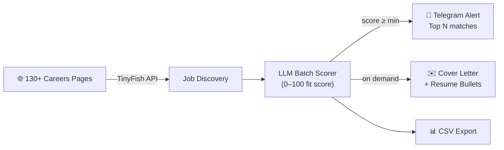

# autopilot-jobhunt

**Your AI job agent. Finds, scores, and drafts applications — while you sleep.**

> Scans 130+ company careers pages nightly → scores every role against your resume with an LLM → sends you the top matches on Telegram → drafts a tailored resume + cover letter on demand.


[](https://pypi.org/project/autopilot-jobhunt/)
[](https://www.python.org/)
[](LICENSE)
[](https://github.com/tarunlnmiit/autopilot-jobhunt/stargazers)

**[📖 Full setup guide with Claude Code MCP integration → SETUP.md](SETUP.md)**

---

## How it works



**The scoring prompt uses your actual resume** — not keywords. The LLM reads your full work history and the job description, then explains in one sentence why you fit or don't. No more guessing.

### What a scan result looks like

```
Scanning Mistral AI...
  3 new job URLs. Fetching details...
  Scoring jobs...
  Saved 2 jobs from Mistral AI

Scanning HuggingFace...
  5 new job URLs. Fetching details...
  Scoring jobs...
  Saved 3 jobs from HuggingFace

Scanning Stripe...
  No new jobs found
...
Scan complete.
Top 5 sent to Telegram.
```

### What the Telegram notification looks like

```
Job Hunt — 06 Jun 2026
5 matches found

#1 | Mistral AI | Applied AI Engineer, ML Infrastructure
📍 Paris/London/Marseille, On-site
🔧 Python, LLMs, RAG, AWS, MLOps, DevOps
✅ Role combines applied AI + ML infrastructure in EU, aligns with MLOps/RAG expertise and relocation goal
Score: 85/100  →  https://jobs.lever.co/mistral/...

#2 | HuggingFace | Staff ML Engineer
📍 Remote (EU)
🔧 Python, PyTorch, Transformers, CUDA, MLOps
✅ Open-source ML role matches deep learning and distributed training background
Score: 80/100  →  https://apply.workable.com/huggingface/...

...

Reply "apply to #N" to draft a tailored application.
```

---

## What it does

```
Every night at 2:30 AM:
  ┌─────────────────────────────────────────────────────────┐
  │  Scans careers pages  →  Scores with LLM  →  Notifies  │
  │       (130+ cos)           (0–100 fit)       (Telegram) │
  └─────────────────────────────────────────────────────────┘

On demand:
  autopilot draft 1  →  tailored resume + cover letter in 60s
```

---

## Usage modes

```
Mode 1: Standalone CLI (no Claude Code required)
  pip install autopilot-jobhunt
  autopilot scan / autopilot draft 1 / autopilot export

Mode 2: Claude Code MCP (control via natural language)
  pip install 'autopilot-jobhunt[mcp]'
  claude mcp add autopilot-jobhunt ...
  → "Scan for ML jobs" / "Draft application for job #2"
```

Both modes use the same config and produce the same output.

## Quick start

### Option A — pip install

```bash
pip install autopilot-jobhunt        # or: pip install 'autopilot-jobhunt[mcp]' for Claude Code
mkdir my-job-hunt && cd my-job-hunt
autopilot init                       # creates config.json, companies.json, resume/, .env
# Fill in config.json (API keys + your profile) and resume/YOUR_RESUME.md, then:
autopilot scan
```

### Option B — clone (recommended if you want to customize companies or contribute)

```bash
git clone https://github.com/tarunlnmiit/autopilot-jobhunt.git
cd autopilot-jobhunt
pip install -e '.'               # standalone CLI
# pip install -e '.[mcp]'       # + Claude Code MCP integration
cp config.example.json config.json && cp .env.example .env
# Fill in your API keys and candidate profile, then:
autopilot scan
```

**For the full walkthrough** — API key setup, Claude Code MCP registration, rate limit details, and troubleshooting — see **[SETUP.md](SETUP.md)**.

### API keys needed

| Service | Cost | Where to get it |
|---|---|---|
| **TinyFish** | **Free** — no credit card | [agent.tinyfish.ai](https://agent.tinyfish.ai) |
| **OpenRouter** | **Free** — 4-model fallback chain | [openrouter.ai](https://openrouter.ai) |
| **Telegram** | Free — optional | [@BotFather](https://t.me/BotFather) on Telegram |

---

## Claude Code / MCP integration

Use autopilot-jobhunt as an MCP server inside **Claude Code** (CLI) or **Claude Desktop**.

### Step 1: Install with MCP support

```bash
git clone https://github.com/tarunlnmiit/autopilot-jobhunt.git
cd autopilot-jobhunt
pip install -e '.[mcp]'
```

### Step 2: Register with Claude Code

**Option A — one command:**

```bash
claude mcp add autopilot-jobhunt \
  --env TINYFISH_API_KEY=your_key \
  --env OPENROUTER_API_KEY=your_key \
  --env TELEGRAM_TOKEN=your_token \
  --env TELEGRAM_CHAT_ID=your_chat_id \
  -- python -m job_hunt.mcp_server
```

**Option B — edit `~/.claude.json` manually:**

```json
{
  "mcpServers": {
    "autopilot-jobhunt": {
      "command": "python",
      "args": ["-m", "job_hunt.mcp_server"],
      "cwd": "/absolute/path/to/autopilot-jobhunt",
      "env": {
        "TINYFISH_API_KEY": "your_key",
        "OPENROUTER_API_KEY": "your_key",
        "TELEGRAM_TOKEN": "your_token",
        "TELEGRAM_CHAT_ID": "your_chat_id"
      }
    }
  }
}
```

> **Note:** `cwd` must point to the cloned repo — the server reads `config.json` and `companies.json` from there.

### Step 3: Use it

In any Claude Code session:

```
"Scan for ML jobs"
"Draft an application for job #2"
"Export jobs from the last 7 days with score above 70"
```

### Claude Desktop

Same JSON block — add it under `mcpServers` in Claude Desktop → Settings → Developer.

---

## Customize your target companies

Edit `companies.json`. Each entry needs:

```json
{
  "name": "Stripe",
  "careers_url": "https://stripe.com/jobs",
  "search_domain": "stripe.com",
  "location": "Remote / San Francisco, CA",
  "region": "Remote"
}
```

The repo ships with 130+ pre-configured EU, NZ, and remote-friendly tech companies. Add or remove as you like.

---

## How scoring works

The LLM reads your full resume + the full job description and assigns a score 0–100:

| Score | Meaning |
|---|---|
| 80–100 | Near-perfect fit — apply immediately |
| 60–79 | Good fit — worth applying |
| 40–59 | Partial fit — apply if pipeline is thin |
| < 40 | Poor fit — skipped |

Set `min_score` in config to filter. Default: 60.

---

## Project structure

```
autopilot-jobhunt/
├── job_hunt/
│   ├── main.py          # CLI entry point
│   ├── scanner.py       # Job discovery + LLM scoring
│   ├── drafter.py       # Resume tailoring + cover letter
│   ├── notifier.py      # Telegram notifications
│   ├── llm_utils.py     # OpenRouter wrapper with fallback
│   ├── tools.py         # Protocol-agnostic tool layer
│   └── mcp_server.py    # MCP server (Claude/AI assistant integration)
├── demo/                # Demo scripts for recording GIF
├── resume/              # Put your resume here (gitignored)
├── state/               # Scan state (gitignored)
├── output/              # Generated applications (gitignored)
├── companies.json       # 130+ target companies
├── config.example.json  # Config template (copy to config.json — gitignored)
└── config.json          # Your config (gitignored — never committed)
```

---

## LLM options

### Default: OpenRouter (free)

Uses a 4-model fallback chain — all free, no credit card needed:

| Model | Role |
|---|---|
| `meta-llama/llama-3.3-70b-instruct:free` | Primary — best quality |
| `nvidia/nemotron-3-super-120b-a12b:free` | Fallback 1 — 120B |
| `google/gemma-4-31b-it:free` | Fallback 2 |
| `qwen/qwen3-coder:free` | Fallback 3 |

If one model hits its daily free-tier quota, the tool automatically tries the next. **Zero LLM cost by default.**

### Alternative: Claude (Anthropic)

If you have an Anthropic API key or Claude Pro:

```bash
pip install 'autopilot-jobhunt[claude]'
```

In `config.json`:

```json
"llm_provider": "anthropic",
"anthropic_api_key": "sk-ant-...",
"anthropic_model": "claude-haiku-4-5-20251001"
```

`claude-haiku-4-5-20251001` is fast and cheap; `claude-sonnet-4-6` gives higher quality scores. A nightly scan uses ~5–15 LLM calls total (jobs scored in batches of 10).

---

## Contributing

See [CONTRIBUTING.md](CONTRIBUTING.md). PRs welcome for:
- Adding companies to `companies.json`
- New ATS platform support (Rippling, Lever variants, Workday)
- OpenAI / Gemini MCP adapters
- Better scoring prompts

---

## License

MIT — see [LICENSE](LICENSE).

---

*Built by [@tarunlnmiit](https://github.com/tarunlnmiit). If this saved you hours of job searching, a ⭐ means a lot.*
